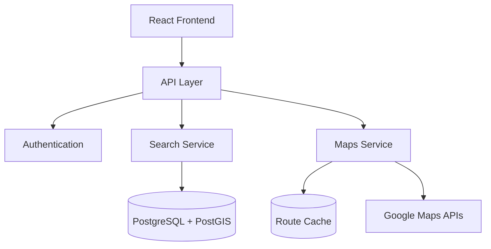
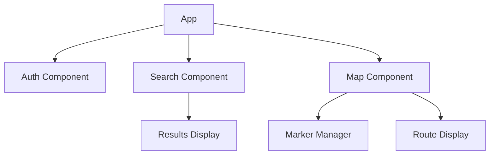
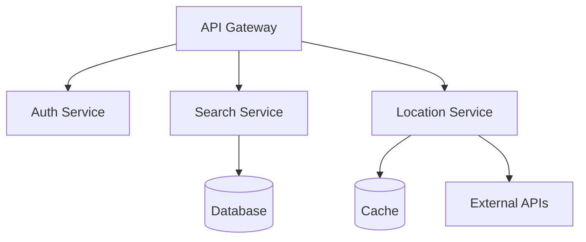

# System Patterns

## Architecture Overview

### System Architecture

## Design Patterns

### User Management
- Role-based access control (RBAC)
- Separation of doctor and patient interfaces
- Metadata-driven user profiles

### Location Services
- Spatial indexing pattern
- Proximity search optimization
- Cached route calculations

### Maps Integration
- Marker clustering for dense areas
- Layer-based map rendering
- Event-driven updates

### Caching Strategy
- Time-based cache invalidation
- Route information caching
- Query result caching

## Component Relationships

### Frontend Components

### Backend Services

## Data Flow Patterns

### Search Flow
1. User initiates search
2. Spatial query execution
3. Route calculation
4. Results aggregation
5. UI update

### Location Updates
1. Location change detection
2. Spatial index update
3. Cache invalidation
4. Client notification

## Error Handling
- Graceful degradation
- Fallback mechanisms
- User feedback loops

## Optimization Patterns
- Query optimization
- Batch processing
- Lazy loading
- Progressive enhancement 